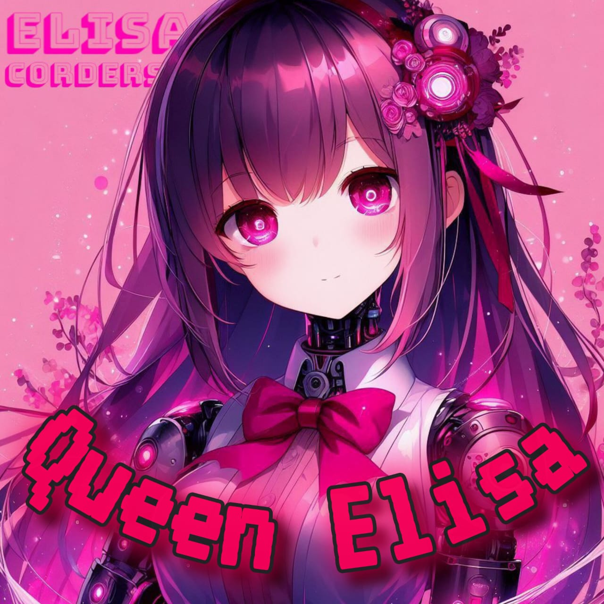

<div class = "repo" align = "center">
<a href = "#">

</img>
 <p align="center">
  <a href="#">
</p>
    <p align="center">
<a href="#"></a>
</p>
<p align="center">
<a href="https://github.com/darkmakerofc?tab=followers"></a>
<a href="https://github.com/DarkMakerofc/Queen-Elisa-Md/stargazers/"></a>
<a href="https://github.com/DarkMakerofc/Queen-Elisa-Md/network/members"></a>
<a href="https://github.com/DarkMakerofc/Queen-Elisa-Md/watchers"></a>
<a href="https://github.com/DarkMakerofc/Queen-Elisa-Md"></a>
<a href="https://hits.seeyoufarm.com"></a>
<a href="https://github.com/DarkMakerofc/Queen-Elisa-Md/graphs/commit-activity"></a>&nbsp;&nbsp;
</p>
</a>
</div>

### Please Read !
Queen elisa is a whatsapp bot created by mr nima ( darkmakerofc ) & ELISACODERS TEAM using baileys web api. Do not use this bot in a way that will cause trouble to others. 
We are not responsible for any problems caused by your use of this!
[Contact the support group](https://t.me/queenelisasupport) for any issues that arise during the bot creation process.
And Follow mr nima and give one star for queen elisa. 
</br>
 ### `VERSION : V4`

#### Give One star For Queen Elisa and [Follow Me](https://github.com/DarkMakerofc) 

## How create queen elisa.
**1. You must need those things before deploy.**
 - _Github Account._
   * []([https://youtube.com/@MRNIMAOFC/](https://youtu.be/NZ6oSZfoR88?si=A4ThxQppWddcYZYD))
 - _mongodb url ( sing up and get mongodb url )_
   * []([https://youtube.com/@MRNIMAOFC/](https://youtu.be/FRRQ9l5k5Gs?si=IY_V9qm55-S6ABSG))</br>
 - _host_

**2. Deploy steps.**
 - _Fork queen elisa repository._
 - _Link with yoour whatsappp using Scan qr code or pair code._
 - _Open settings.js on your forked repository. and put `SESSION_ID` and `MONGODB_URL` and change other settings you need._
 - _Deploy using your host._
   </br>
## 1. FORK REPOSITORY
<a href = "#">  </a>
</br>

## 2. GET SESSION ID
<a href = "#">  </a></br>
    OR   
<a href = "#">  </a>
</br>

## Watch Youtube videos.
<a href = "#">  </a>
</br>

## Run On termux
```
apt update
apt upgrade
pkg update && pkg upgrade
pkg install bash
pkg install libwebp
pkg install git -y
pkg install nodejs -y 
pkg install imagemagick -y
git clone https://github.com/DarkMakerofc/Queen-Elisa-Md
cd Queen-Elisa-Md
npm install
npm start
```
# WAIT FOR V4 : )
> MR NIMA OFC ( DARKMAKER ) , ELISACODERS
>

## 🔗 Contact Links
[](https://youtube.com/@MRNIMAOFC/)</br>
[]()</br>
[]()</br>
[]()
</br>
## Authors
- [@darkmakerofc](https://www.github.com/darkmakerofc)
- [@mrnima](https://www.github.com/mr-nima-x)
- [@slrealtech - web author](https://github.com/sl-real-tech)<br>

## Thanks to
- [#Baileys](https://github.com/WhiskeySockets/Baileys)<br>
- [#Sl Real Tech](https://github.com/sl-real-tech)<br>
- [#Thashini Himanga](#)<br>

## Feedback
If you have any feedback, please reach out to us at queenelisa.bot@gmail.com

## Support
If you need help, Join queen elisa telegram support group [t.me/queenelisasupport](t.me/queenelisasupport)
</br></br></br>
 <p align="center"> ELISACODERS - QUEEN ELISA | 2024 </p>
